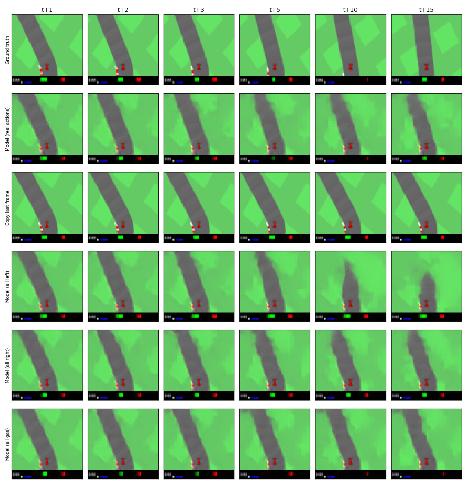
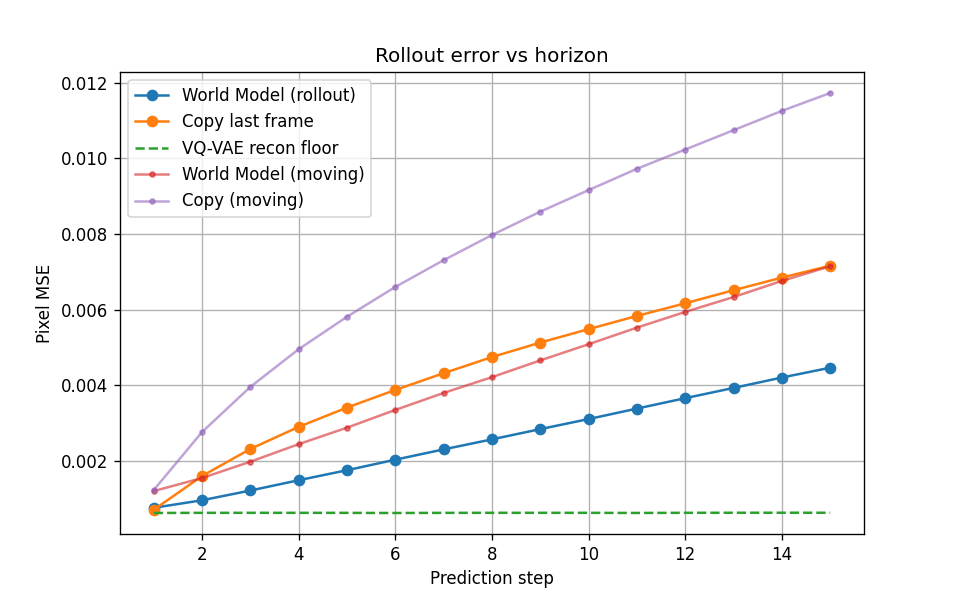

## CarRacing World Model

Gymnasium `CarRacing-v3` 환경에서 현재 화면과 행동으로 미래 화면을 예측하는 World Model을 PyTorch로 구현한 프로젝트

### Model Architecture

```
64x64 이미지 ──VQ-VAE 인코더──▶ 16x16 이산 토큰 ──World Transformer(+행동)──▶ 다음 프레임 토큰 ──VQ-VAE 디코더──▶ 예측 이미지
```

1. **Vision: EMA VQ-VAE** (`vq_vae.py`)
   - 64x64 게임 화면을 16x16개의 이산 토큰(코드북 512개)으로 압축하고, 토큰을 다시 이미지로 복원
   - Loss: MSE + VGG LPIPS (시각적 디테일 보존)

2. **Memory: World Transformer** (`world_transformer.py`)
   - 최근 5 프레임의 토큰과 행동(조향/가속/브레이크)을 입력받아 다음 프레임의 토큰을 예측
   - Causal mask로 각 프레임은 과거 프레임만 참조

3. **Data** (`data_play.py`)
   - 수동 주행으로 이미지-행동 쌍 10,000개 수집 (Controller는 수동 주행으로 대체)

### Result

예측한 프레임을 다시 입력으로 넣어 15 step 앞까지 예측한 결과



행: 실제 / 모델 예측 / 직전 프레임 복사 / 좌회전 고정 / 우회전 고정 / 가속 고정, 열: 예측 step



- 직전 프레임을 그대로 복사하는 것보다 15 step 예측 오차가 38% 낮음
- 조향 입력에 따라 다른 미래를 예측함 (가속 데이터가 적어 가속에는 거의 반응하지 않음)
